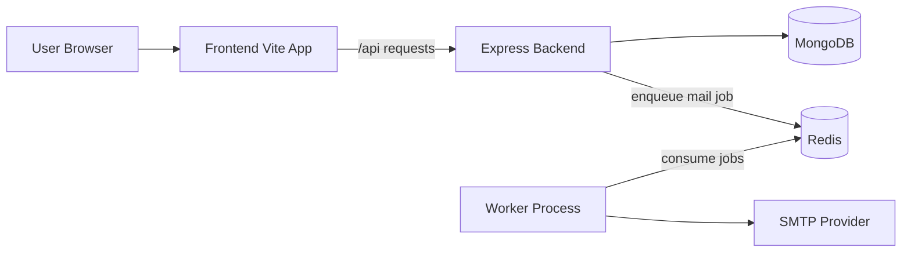

# Clutch - Scaled Event Platform (Backend + Frontend)

Clutch is now implemented as a production-style tournament registration platform with authentication, role-based access, validation, background job processing, API docs, and containerized local deployment.

This README explains what each major addition does and why it exists from an industry point of view.

## What Is Implemented

### 1) Authentication and Authorization
- JWT-based auth is implemented for protected APIs.
- Roles are implemented: `admin`, `coordinator`, `player`.
- Protected backend routes verify token and role before allowing access.
- Frontend now has login/register flows and protected UI routes.

Why this matters:
- This separates public and privileged actions, which is expected in real-world systems.

### 2) Request Validation with Zod
- Request payloads and params are validated using Zod schemas.
- Validation runs before controller logic.
- Invalid input returns clear 4xx-style errors.

Why this matters:
- Prevents bad data from entering core business logic.
- Keeps controller code cleaner and predictable.

### 3) Centralized Error Handling
- Async handlers route errors to one error middleware.
- Operational errors and validation issues are normalized.

Why this matters:
- Consistent API error shape helps frontend and observability.

### 4) Security and Hardening Middleware
- `helmet` for security headers.
- `express-rate-limit` for request throttling.
- `compression` for response optimization.
- CORS is environment-driven.

Why this matters:
- Baseline protection and performance for internet-facing services.

### 5) Logging and Observability Basics
- Structured logging is enabled through `pino` and `pino-http`.
- Request-level logs include response status and latency context.

Why this matters:
- Better debugging, monitoring, and incident triage in production.

### 6) Redis + BullMQ Background Jobs
- Team registration enqueues email verification jobs.
- A dedicated worker consumes jobs and sends emails.
- Retry/backoff policies are configured on queue jobs.
- If queue is unavailable, fallback delivery logic is used.

Why this matters:
- API response is decoupled from email network latency.
- Improves reliability and throughput under load.

### 7) Docker and Docker Compose Stack
- Full local stack is containerized: frontend, backend, worker, MongoDB, Redis.
- One command can bring up all services.

Why this matters:
- Reproducible setup across machines.
- Faster onboarding and less environment drift.

### 8) OpenAPI/Swagger Documentation
- Swagger UI is exposed at:
  - `/api/docs`
  - `/api/v1/docs`

Why this matters:
- Enables clear API discoverability for frontend/dev/test teams.

### 9) Pagination and Query Controls
- Games listing supports `page`, `limit`, `search`, `sortBy`, `sortOrder`.
- API response includes pagination metadata.

Why this matters:
- Scale-ready list APIs avoid large payloads and improve UX.

### 10) Frontend Integration with Backend Auth
- Frontend now stores and sends JWT via API client interceptor.
- Auth context manages session and user info.
- Protected frontend route guards admin/coordinator pages.
- Navbar reflects login state and supports logout.

Why this matters:
- Backend security model is reflected in actual user flows.

## Architecture Flow



## Tech Stack

### Backend
- Node.js + Express
- Mongoose (MongoDB)
- Zod validation
- JWT (`jsonwebtoken`)
- Security middleware (`helmet`, `express-rate-limit`, `compression`)
- Logging (`pino`, `pino-http`)
- Queue (`bullmq`, `ioredis`)
- API docs (`swagger-jsdoc`, `swagger-ui-express`)

### Frontend
- React + Vite
- React Router
- Axios API client with auth header interceptor

### Infra
- Docker
- Docker Compose
- MongoDB
- Redis

## Environment Variables

Copy `.env.example` to `.env` and fill values.

```env
NODE_ENV=development
PORT=1234
MONGO_URI=
REDIS_URL=redis://localhost:6379
CLIENT_ORIGIN=http://localhost:5173
APP_BASE_URL=http://localhost:1234
JWT_SECRET=replace-with-strong-secret
JWT_EXPIRES_IN=1d
EMAIL=
PASS=
VITE_API_PROXY_TARGET=http://localhost:1234
```

Variable notes:
- `MONGO_URI`: MongoDB connection string for app data.
- `REDIS_URL`: Redis used by BullMQ queue + worker.
- `JWT_SECRET`: key used to sign and verify access tokens.
- `CLIENT_ORIGIN`: allowed browser origin for CORS.
- `APP_BASE_URL`: backend base URL used in verification links.
- `EMAIL` / `PASS`: SMTP credentials for outgoing mail.

## How to Run

### Option A: Local (without Docker)

1. Install dependencies:

```bash
npm install
npm run insta
```

2. Run backend + frontend:

```bash
npm run dev
```

3. Run backend + worker + frontend:

```bash
npm run dev:full
```

4. Run services separately if needed:

```bash
npm start
npm run start:worker
cd frontend && npm run dev
```

### Option B: Docker Compose (recommended)

```bash
docker compose up --build
```

Services after startup:
- Frontend: http://localhost:5173
- Backend: http://localhost:1234
- Swagger: http://localhost:1234/api/docs
- MongoDB: localhost:27017
- Redis: localhost:6379

## API Summary

Base path: `/api` (also mirrored at `/api/v1`)

### Auth
- `POST /api/auth/register`
- `POST /api/auth/login`
- `GET /api/auth/me`

### Games
- `GET /api/games`
  - query: `page`, `limit`, `search`, `sortBy`, `sortOrder`
- `POST /api/games/add` (protected: admin/coordinator)

### Team Registration
- `POST /api/team`
  - creates players and team
  - enqueues verification emails via Redis queue

### Player Verification
- `GET /api/player/:token`

### Team View
- `GET /api/team/:gameName` (protected in current RBAC setup)

## Testing

Run tests:

```bash
npm test
```

Current suite includes health endpoint coverage and can be expanded to integration tests for auth, games, and team flows.

## Frontend Notes

- Frontend routes now include auth pages and a protected admin page.
- Admin game creation calls protected backend endpoint with JWT.
- Existing registration form was updated to match paginated games API response shape.

## Important Operational Notes

- Backend startup requires a valid `MONGO_URI`.
- Worker startup requires a valid `REDIS_URL`.
- If Redis is unavailable, email dispatch falls back to direct send in registration flow.
- Swagger docs are served by backend and do not require frontend.

## Repository Highlights

- Backend app entry: `index.js`
- Queue worker entry: `worker.js`
- Compose stack: `docker-compose.yml`
- Backend Dockerfile: `Dockerfile`
- Frontend Dockerfile: `frontend/Dockerfile`
- Environment template: `.env.example`

## License

No license file is currently included. Add a `LICENSE` file if this repository will be distributed publicly.
