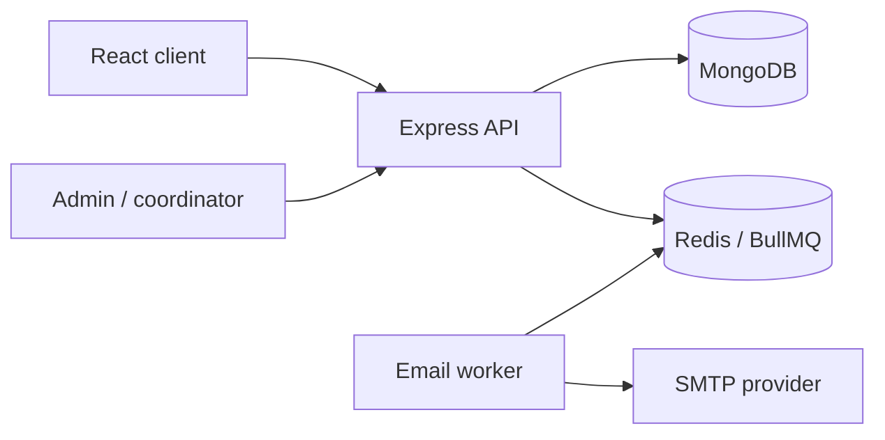

# Clutch — Esports Tournament Platform

Clutch is a full-stack platform for running campus esports events. Players can discover games and register their teams, while coordinators can create games and publish tournaments. The project is designed as a practical tournament-management foundation rather than a static registration page.

## What you can do today

### Players

- Browse the public tournament hub.
- Filter tournaments by status and search by title.
- Open a tournament page to see its game, schedule, format, prize pool, registration deadline, and rules.
- Register a team for a game and verify player email addresses.
- Create an account and sign in.

### Coordinators and admins

- Create games with player limits, artwork, and rules.
- Create upcoming single-elimination or round-robin tournaments.
- Set registration deadlines, start times, team limits, entry fee, prize pool, banner, and rules.
- Use protected routes and APIs through JWT role-based authorization.

## Product map

```text
Public site
├── Home                 Landing page, game showcase, event highlights
├── Tournament hub       Search and filter active / upcoming / completed events
├── Tournament detail    Rules, schedule, prize pool and registration CTA
├── Team registration    Team and player entry for a selected game
├── Sign in / Register   Account access
└── Organizer workspace  Protected game and tournament creation tools
```

## Technology

| Area | Tools |
| --- | --- |
| Frontend | React, Vite, React Router, Tailwind CSS, Axios |
| Backend | Node.js, Express, Mongoose, Zod |
| Data | MongoDB |
| Authentication | JWT, bcryptjs, role-based access control |
| Background jobs | Redis, BullMQ, Nodemailer |
| Operations | Docker, Docker Compose, Pino logging, Swagger/OpenAPI |

## Architecture


```mermaid
flowchart LR
  Browser[React client] --> API[Express API]
  API --> Mongo[(MongoDB)]
  API --> Redis[(Redis / BullMQ)]
  Worker[Email worker] --> Redis
  Worker --> SMTP[SMTP provider]
  Admin[Admin / coordinator] --> API
```

The React app calls the Express API under `/api`. The API validates incoming data, checks permissions where needed, persists to MongoDB, and puts email-verification work onto the Redis queue. If Redis is unavailable, registration falls back to direct email delivery.

## Roles and access

| Role | Main permissions |
| --- | --- |
| `player` | Create an account, browse events, register a team |
| `coordinator` | Player permissions plus game and tournament creation |
| `admin` | Full coordinator permissions; intended for platform operators |

> For a public production deployment, do **not** allow a visitor to select `admin` or `coordinator` during sign-up. Assign privileged roles from a protected admin process instead.

## API reference

Swagger is available after starting the server:

- `http://localhost:1234/api/docs`
- `http://localhost:1234/api/openapi.json`

### Authentication

| Method | Path | Description |
| --- | --- | --- |
| `POST` | `/api/auth/register` | Create an account and receive a JWT |
| `POST` | `/api/auth/login` | Sign in and receive a JWT |
| `GET` | `/api/auth/me` | Return the signed-in user |

### Games and teams

| Method | Path | Access | Description |
| --- | --- | --- | --- |
| `GET` | `/api/games` | Public | Paginated game list; supports `page`, `limit`, `search`, `sortBy`, `sortOrder` |
| `POST` | `/api/games/add` | Admin / coordinator | Create a game |
| `POST` | `/api/team` | Public | Register a team and player list for a game |
| `GET` | `/api/team/:gameName` | Admin / coordinator | View teams registered for a game |
| `GET` | `/api/player/:token` | Public | Verify a player email token |

### Tournaments

| Method | Path | Access | Description |
| --- | --- | --- | --- |
| `GET` | `/api/tournaments` | Public | List tournaments; optional `status`, `gameId`, and `search` filters |
| `GET` | `/api/tournaments/:slug` | Public | Fetch one tournament’s public detail |
| `POST` | `/api/tournaments` | Admin / coordinator | Create a tournament |

Example create request:

```json
{
  "title": "Clutch Valorant Open",
  "gameId": "MONGODB_GAME_ID",
  "description": "A campus Valorant tournament for five-player teams.",
  "format": "single-elimination",
  "startsAt": "2026-09-12T09:00:00.000Z",
  "registrationClosesAt": "2026-09-10T18:00:00.000Z",
  "maxTeams": 16,
  "prizePool": 10000,
  "entryFee": 0,
  "bannerUrl": "https://example.com/banner.jpg",
  "rules": ["Teams must check in 30 minutes before the match.", "No substitutes after bracket lock."]
}
```

Send the JWT from login in the request header:

```text
Authorization: Bearer YOUR_ACCESS_TOKEN
```

## Local setup

### Requirements

- Node.js 18 or newer
- MongoDB
- Redis (recommended for queued verification email)
- An SMTP account if you want verification mail delivery

### 1. Configure environment variables

Copy the example file:

```powershell
Copy-Item .env.example .env
```

Then supply values in `.env`:

```env
NODE_ENV=development
PORT=1234
MONGO_URI=mongodb://127.0.0.1:27017/clutch
REDIS_URL=redis://localhost:6379
CLIENT_ORIGIN=http://localhost:5173
APP_BASE_URL=http://localhost:1234
JWT_SECRET=use-a-long-random-secret
JWT_EXPIRES_IN=1d
EMAIL=your-smtp-email
PASS=your-smtp-password-or-app-password
VITE_API_PROXY_TARGET=http://localhost:1234
```

### 2. Install dependencies

```powershell
npm install
Set-Location frontend
npm install
Set-Location ..
```

### 3. Run the application

Start backend and frontend together:

```powershell
npm run dev
```

Start backend, frontend, and the email worker:

```powershell
npm run dev:full
```

Open these URLs:

- Frontend: `http://localhost:5173`
- Backend health check: `http://localhost:1234/healthz`
- API docs: `http://localhost:1234/api/docs`

### Docker option

Docker starts the frontend, API, worker, MongoDB, and Redis together:

```powershell
docker compose up --build
```

## Useful commands

| Command | Purpose |
| --- | --- |
| `npm run dev` | Run backend and frontend in development |
| `npm run dev:full` | Run backend, frontend, and email worker |
| `npm run build` | Build the React client for production |
| `npm test` | Run backend tests |
| `npm run db:indexes` | Create declared database indexes |
| `npm start` | Run backend only |
| `npm run start:worker` | Run the email queue worker only |

## Repository guide

```text
config/        Environment, database, Redis and Swagger configuration
controllers/   API request handlers
frontend/      React application
middleware/    Authentication, validation and error handling
models/        MongoDB/Mongoose schemas
queue/         BullMQ queue definitions
routes/        Express endpoints
utils/         JWT, mail, logging and error helpers
validators/    Zod schemas for incoming requests
worker.js      Background email job consumer
```

## Recommended next modules

The current tournament hub is a solid base. To make it a complete event platform, build these next:

1. Tournament registration linked directly to teams.
2. Bracket generation and match scheduling.
3. Match result entry, winner advancement, and live score pages.
4. Player and team profile pages with event history.
5. Leaderboards, achievements, and organizer analytics.
6. In-app notifications for check-in, match assignment, and results.
7. Payments for paid-entry tournaments.

## Quality checks

Before opening a pull request, run:

```powershell
npm run build
npm test
```

## License

No license has been selected yet. Add a `LICENSE` file before distributing this project publicly.
